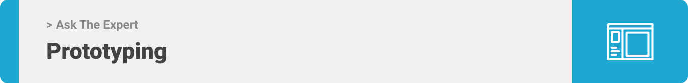
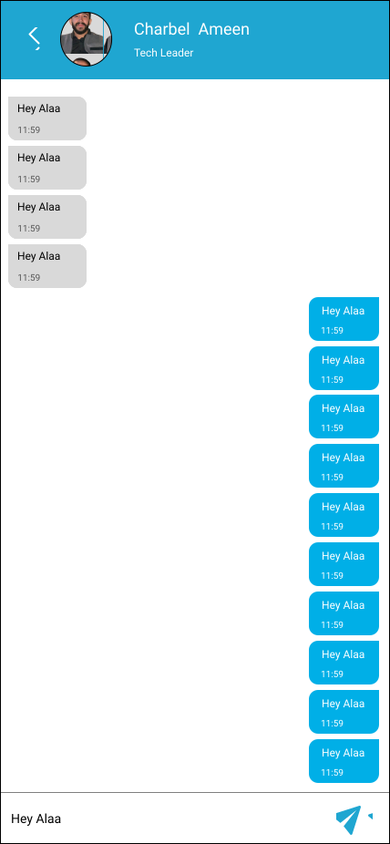

<div align="center">

> Hello world! This is the project’s summary that describes the project plain and simple, limited to the space available.

**[PROJECT PHILOSOPHY](#project-philosophy) • [PROTOTYPING](#prototyping) • [TECH STACK](#tech_stack) • [IMPLEMENTATION](#implementation) • [HOW TO RUN?](#how_to_run)**

</div>

<br><br>

<a id="project-philosophy"></a>


> Ask The Expert application is a meeting and chatting app built to make answers or ambigious career improvements one question or click away. Ask the Expert app is more than just a meeting application, it gives you the ability to boost your career start from experts close to you until someday you become the expert people want to book with.
>
> The Application would access the location of expert at the moment he/she show as available, and also would access the novice location on home page loads/refresh so it can get back expert within the novice area.

### User Stories:

#### &nbsp; &nbsp; &nbsp; As a User:

- I want to change the language of my app so that I can use it freely.
- I want to change the theme to dark so that I use it comfortably at night.
- I want to remove appointments that I wouldn't be able to attend anymore so that I wouldn't miss the appointment.

#### &nbsp; &nbsp; &nbsp; As a Novice:

- I want to book appointments with available experts close to me within same field so I can learn and ask questions about my field.
- I want to chat with experts so that I can make sure that my appointment will benefits me as much as possible or to recheck whether he/she will be available again.
- I want to view the leaderboard and visualize the top experts, so If I viewed this expert available would instantly book with him/her.

#### &nbsp; &nbsp; &nbsp; As an Expert:

- I want to set availability to online so that I can gain scores and be on the top of the leaderboard.
- I want to intiate and chat with novices so I can get more points and help novices reach their answers
- I want to view the leaderboard and visualize the top experts, so I can try to reach the top and view the difference score.

#### &nbsp; &nbsp; &nbsp; As an Admin:

- I want to be able to view statistics of my users, new appointments, and new chats.
- I want to ban or unban user from accessing the application.

<br><br>

<a id="prototyping"></a>


> This design was planned before as wireframes, then moved to mockups for the fine details as shown below.

| Login                                   | Novice Home                                         | Expert Home                                            | Leaderboard                                         |
| --------------------------------------- | --------------------------------------------------- | ------------------------------------------------------ | --------------------------------------------------- |
|  |  |  |  |

| Appointments                                             | Set Availability                                              | Book Appointment                                              | Single Chat                                         |
| -------------------------------------------------------- | ------------------------------------------------------------- | ------------------------------------------------------------- | --------------------------------------------------- |
|  |  |  |  |

<br><br>

<a id="tech_stack"></a>


Here's a brief high-level overview of the tech stack the Ask The Expert app uses:

- This project uses the [React Native Expo Cli](https://docs.expo.dev/workflow/expo-cli/). Expo is a framework to build React Native apps. It is a set with tools and services built for React Native. It will help you begin with building React Native apps with ease. It provides you with a list of tools that simplify the creation and testing of React Native app.

- For backend [ExpressJS](https://mongoosejs.com/) is used, implementing the model-view-controller design pattern, which is a minimal and flexible Node.js web application framework that provides a robust set of features to develop web and mobile applications. It facilitates the rapid development of Node based Web applications.

- For persistent storage (database), the app uses the [Mongoose](https://mongoosejs.com/) object modeling package which allows the app to create a custom storage schema and save it to a local nonSQL mongo database.

- To send local push notifications, the app uses the [Expo_Notifications_Using_FCM](https://docs.expo.dev/push-notifications/using-fcm/) package which supports all Android apps using Expo SDK.

- To maintain a live chat between users, the app uses the [Firebase_Firestore](https://firebase.google.com/products/firestore/) to store users chats and messages.

- To authenticate users, get user id, and check email uniqueness and password match, the app uses [Firebase_Authentication](https://firebase.google.com/products/auth) before getting the data from MongoDB.
  
- To save or update users profile images, the app use [Firebase_Storage](https://firebase.google.com/products/storage) and saves the profile_url in MongoDB.

- The app uses the font ["Roboto"](https://fonts.googleapis.com/css2?family=Roboto) as its main font, and the design of the app adheres to the material design guidelines.

<br><br>

<a id="implementation"></a>


> Using the above mentioned tech stacks and the wireframes build with figma from the user stories we have, the implementation of the app is shown as below, these are GIFs from the real app 
> 
> Below GIFs may take some time to load

| Novice (french - dark mode)                                                | Expert (english - light mode)                                          | Admin                                          |
| ----------------------------------------------------- | ----------------------------------------------- | ---------------------------------------------- |
|  |  |  |

<br><br>

<a id="how_to_run"></a>


> This is an example of how you may give instructions on setting up your project locally.
> To get a local copy up and running follow these simple example steps.

### Prerequisites

- Download and Install [Node.js](https://nodejs.org/en/)
- For any OS :
  - You Can scan the barCode for expo cli (frontend) and use it in Expo Go App on your phone (ios or android).
- Only For Windows/Linux:
  - Download and Install [Android Studio](https://developer.android.com/studio/index.html)
  - Download an android emulator device or connect a real android device to your computer.
- Only For Apple/MacOS:
  - Download and Install [XCode](https://developer.apple.com/xcode/resources/)
  - Download an android emulator device or connect a real ios device to your computer.

### Installation

_Below is an example of how you can instruct your audience on installing and setting up your app. This template doesn't rely on any external dependencies or services._

1. Clone the repo
   ```sh
   git clone https://github.com/mohammadammash/ask_the_expert.git
   ```
2. Navigate to the backend folder and run the following commands:
   ```sh
   npm install
   #[After npm install terminates successfully]:
   #[Navigate to node_modules/@types/index.d.ts and to your global scope]:
          declare global {
            namespace Express {
              interface Request {
                currentUser_id: String,
                                 }
                              }
                        }
   -Copy '.env.example' file and rename it to '.env' and fill the empty variables
   #[Finally run your server]
   npm start
   ```
3. Navigate to the frontend folder and run following commands:
   ```sh
   npm install
   #[Navigate to src/networks/base.ts and replace base url by current local IPv4:Port]
   npm start
   ```
4. Scan the frontend Expo barcode from the terminal or open it using an emulator and enjoy your tour🎉.
